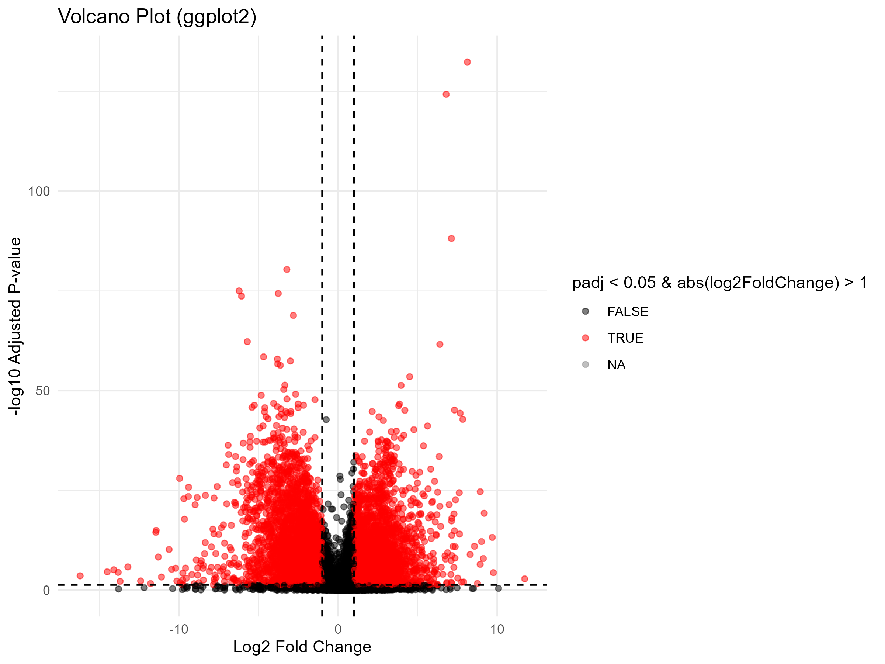

# TCGA-BRCA-Differential-Expression
Bioinformatics pipeline for RNA-seq analysis of Breast Cancer using TCGAbiolinks and DESeq2
# TCGA Breast Cancer (BRCA) Transcriptomic Analysis

## Project Overview
This project performs a differential expression analysis comparing Primary Solid Tumor samples vs. Solid Tissue Normal samples from the TCGA-BRCA cohort.

## Methods
- **Data Source:** TCGA (via `TCGAbiolinks`)
- **Sample Size:** 30 Tumor, 30 Normal
- **Pipeline:** `DESeq2` for statistical modeling and `apeglm` for Log Fold Change shrinkage.
- **Filtering:** Genes with < 10 reads were removed.

## Key Findings
- **Top Up-regulated Gene:** COL10A1 (Type X Collagen), suggesting significant extracellular matrix remodeling.
- **Visualizations:** The Volcano plot shows distinct transcriptomic signatures with high significance (p < 0.05).

## Visuals

