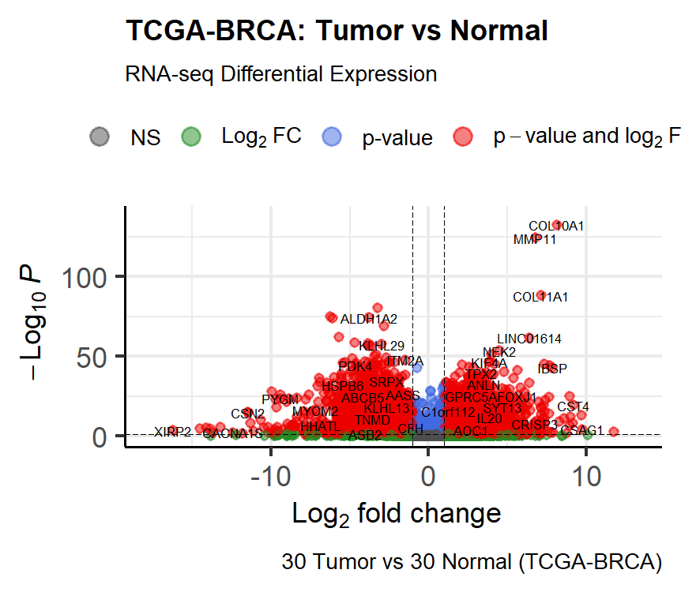

# TCGA-BRCA-Differential-Expression
Bioinformatics pipeline for RNA-seq analysis of Breast Cancer using TCGAbiolinks and DESeq2
# TCGA-BRCA Tumor vs Normal RNA-seq Analysis

## Overview
This project performs a comprehensive differential gene expression analysis comparing
primary breast cancer tumors to solid tissue normal samples using RNA-seq data from
The Cancer Genome Atlas (TCGA-BRCA).

The goal is to identify high-confidence genes that distinguish tumor from normal breast
tissue and provide a foundation for downstream subtype-specific and drug discovery
analyses.

## Dataset
- **Source:** TCGA (The Cancer Genome Atlas)
- **Project:** TCGA-BRCA
- **Data Type:** RNA-seq gene expression (STAR-counts)
- **Samples Used:**
  - Tumor: 30
  - Normal: 30

## Methods

### Data Acquisition
RNA-seq data and clinical metadata were downloaded directly from the Genomic Data Commons
using the `TCGAbiolinks` R package.

### Preprocessing
- Low-count genes were filtered
- Samples were annotated as Tumor or Normal
- Variance Stabilizing Transformation (VST) was applied for visualization

### Differential Expression Analysis
- Differential expression was performed using **DESeq2**
- Log2 fold-change shrinkage was applied
- Significant genes were defined using:
  - Adjusted p-value (FDR) < 0.05
  - |log2FoldChange| > 1

## Results

### Differentially Expressed Genes
- Thousands of genes were significantly altered between Tumor and Normal samples
- Both upregulated and downregulated gene sets were identified

### Visualization
- **Volcano plot** highlights significantly dysregulated genes
- **Heatmap** of top high-confidence genes shows clear separation between Tumor and Normal samples

## Key Findings
- Tumor samples cluster distinctly from Normal samples
- Upregulated genes include cancer-associated and proliferative markers
- Downregulated genes reflect loss of normal tissue-specific functions
- Results confirm strong biological signal and dataset quality

## Tools & Packages
- R (v4.5.2)
- TCGAbiolinks
- DESeq2
- pheatmap
- ggplot2
- org.Hs.eg.db
- apeglm
- Enhancedvolcano
- summarized experiment

## Next Steps
This project serves as a foundation project in a larger pipeline.
Future work includes:
- Triple-Negative Breast Cancer (TNBC)–specific analysis
- Functional enrichment (GO/KEGG)
- Structure-based drug discovery and molecular docking
- 
## Author
**Imhanbor Joseph Osemudiamen**  
Research assistant at the Lagos State University Genomics and Drug Discovery Lab (LASU), Nigeria.  

## Visuals

